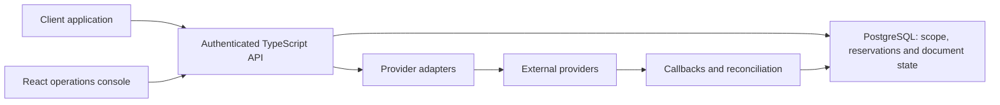

# Fiscal API — Reliable Operations Across External Providers

A multi-tenant API and operations console for Brazilian fiscal documents. My work includes TypeScript serverless endpoints, PostgreSQL modeling, provider integration, error contracts and recovery workflows, alongside a React interface.

## The problem

A provider timeout does not establish that a document was rejected. A provider may have accepted it before the response was lost. Treating every timeout as a failure creates a risk of duplicate submission and contradictory local state.

## My contribution

I worked on distinguishing uncertain outcomes from confirmed failures, reserving document numbers in the database and preventing a source invoice from being billed again while an existing operation is active or unresolved.

The duplicate billing guard checks source references within the tenant and environment before the provider request. It distinguishes an already billed invoice from one whose processing is still unresolved and returns an actionable conflict response.

I also worked on a number allocation incident: an outdated database function failed after a required tenant field was added, while an application fallback could derive the next number outside the intended transaction. The correction derives tenant scope, reserves the number atomically and stops before submission when reservation fails.

## Architecture

This diagram summarizes responsibilities, not a deployment topology.

## Decisions and tradeoffs

| Decision | Reason | Cost or boundary |
| --- | --- | --- |
| Preserve an uncertain state | A timeout alone is insufficient evidence for resubmission. | Resolution may require a provider query or operational review. |
| Guard duplicate billing in PostgreSQL | Multiple clients can submit overlapping requests. | The guard depends on reliable source references in stored payloads. |
| Reserve numbers before sending | Application-side fallback numbering can conflict with shared state. | Allocation failure must stop issuance. |
| Return a limited conflict contract | Clients need recovery instructions. | Internal database errors and entire rows should not be exposed. |

## Evidence and limits

On September 9, 2026, two existing isolated database test files were executed: number allocation and duplicate billing protection. Node reported **20 tests passed, 0 failed**, including parent tests and subtests. They exercised migrations in an in-memory PGlite database and required no production connection.

The tests check scope separation, active and uncertain billing states, validation, permissions and number allocation. PGlite uses one connection; this is **not a multi-session concurrency benchmark**, a complete security audit or a fresh production health check. See [verification details](../../docs/verification.md).

Historical source references can be incomplete. A guard cannot identify every document issued outside the platform or reconstruct absent relationships without trustworthy data. I would discuss this boundary explicitly with an integration consumer.

## Interview walkthrough

Start with a timed-out issuance, inspect the state and operation identity, explain why a retry may be unsafe, then show how database guards and reconciliation guide recovery. Discuss both the prevented failure and the situations that still need human judgment.

[Back to portfolio](../../README.md)
