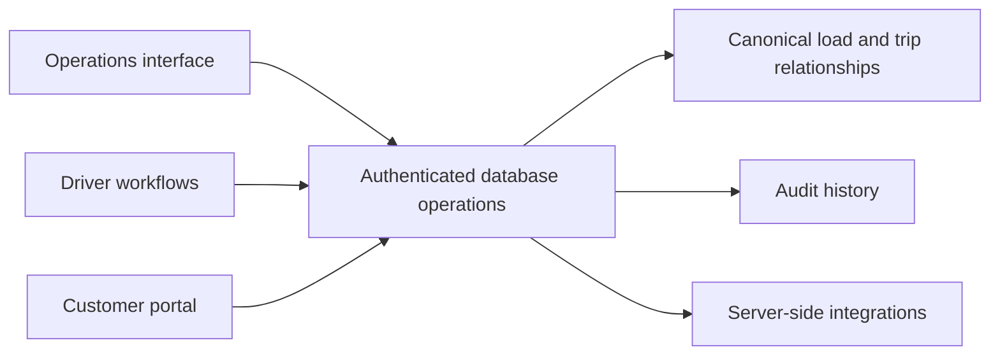

# Logistics Platform — Consistent Dispatch and Operational State

A transportation management platform covering loads, trips, fleet, driver execution, a customer portal, fiscal workflows and finance.

My contribution spans React and TypeScript interfaces, PostgreSQL data modeling, Supabase integration, transactional operations and production troubleshooting.

## The problem

Operational screens can appear correct while writing to different representations of the same relationship. If load composition or trip assignment has competing sources of truth, later dispatch, delivery and customer-facing workflows may disagree.

## My contribution

I worked on explicit contracts for load composition and trip-to-load assignment. Mutations go through database operations that update the authoritative relationships. Related views and query caches need to reflect confirmed changes rather than infer success from partial client state.

The driver and customer workflows add another constraint: knowing a record identifier is not sufficient authorization to access it. Role-specific operations must validate both identity and permitted business scope.

## Architecture

## Decisions and tradeoffs

- **Canonical relationships:** define which records own composition and assignment. Compatibility fields may remain, but cannot become independent write paths.
- **Transactional mutations:** move business invariants into controlled operations instead of coordinating several unrelated browser writes.
- **Confirmed UI state:** guard repeated submission, reject stale context and invalidate dependent queries after confirmation.
- **Role-specific access:** validate driver and customer scope on the server; interface visibility is only a usability layer.

Central contracts reduce ambiguity but require every dependent workflow to respect them. Changes need coordinated updates to mutations, views, tests and recovery documentation.

## Evidence and limits

The source includes a data contract, a production runbook, SQL security tests, React mutation tests and Playwright scenarios. A reviewed mutation test covers repeated submission and an identity or tenant change while a request is in flight. A reviewed browser scenario checks access to known identifiers belonging to another tenant.

These files were inspected for this portfolio; the logistics application and its test suites were not executed in this preparation session. No throughput, uptime or production coverage percentage is claimed.

## Interview walkthrough

Follow a load from planning to dispatch and delivery. Identify the owner of each relationship, show the mutation boundary, explain what happens when a user submits twice or changes tenant mid-request, and describe how support investigates inconsistent state.

[Back to portfolio](../../README.md)

